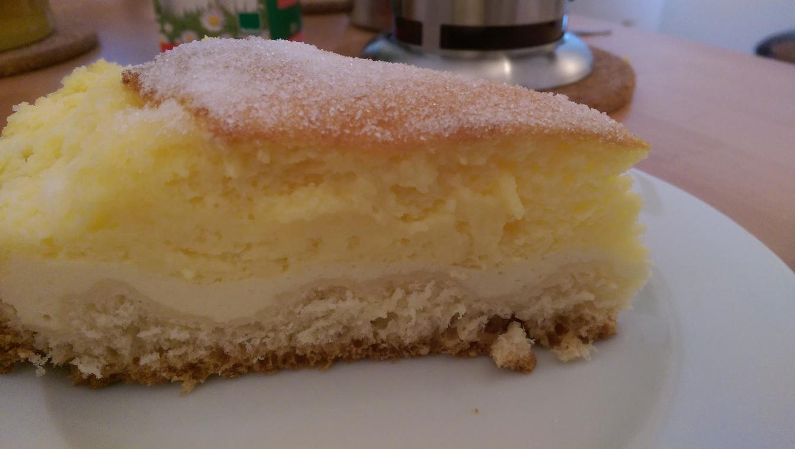

# Eierschecke

## Quelle
[B&auml;ckerei Wippler](http://www.baeckerei-wippler.de/index.php?lang=de&node=eierschecke-michael-wippler)

## Zutaten

### Hefeteig

- 125 g Weizenmehl
- 25 g Butter
- 25g Zucker
- 10 g Hefe frisch
- 50 g Milch
- 1 Ei
- 1 Prise Salz

### Quarkmasse

- 200g Speisequark
- 30g Butter
- 30g Zucker
- 10g Weizenmehl
- 10g Puddingpulver
- 20g Milch
- 1Stck Ei
- Prise Salz
- Zitronensaft

### Scheckenmasse

- 350ml Milch
- 175g Butter
- 175g Zucker
- 5Stck Eier
- 50g Puddingpulver (Vanille)
- Prise Salz

## Zubereitung

### Hefeteig

Alle Zutaten sollten Raumtemperatur haben.
Die Hefe mit der handwarmen Milch und der Hälfte des Mehles zu einem weichen Teig verrühren.
Der Teig soll ein halbe Stunde ruhen. Wenn der Teig schön aufgegangen ist, die restlichen Zutraten dazugeben und kräftig durchkneten. Teig abdecken und nochmals 30 Minuten ruhen lassen.

### Quarkmasse

Während der Hefeteig ruht, Butter flüssig werden lassen und mit Quark, Zucker, Mehl, Puddingpulver, Milch und dem Ei zu einer glatten Masse rühren.
Eine Prise Salz und einen Spritzer Zitronensaft dazugeben.

Den Hefeteig gleichmäßig ausrollen und in eine gefettete Springform geben.
Am Rand den Teig schön andrücken und den Boden ein paar Mal mit einer Gabel einstechen. Die Quarkmasse auf dem Teig verteilen und glatt streichen. Je nach Geschmack, eine Handvoll Rosinen darauf streuen (Kann man aber auch weglassen).

### Scheckenmasse

275 ml Milch mit 85 g Zucker zum Kochen bringen.
Die restliche Milch mit dem Puddingpulver anrühren und zur gezuckerten Milch geben, einmal aufkochen lassen und dann vom Herd nehmen.
Die Eier sauber trennen.
Butter und Eigelbe in den heißen Pudding geben und gut verrühren.
Eiweiß mit dem restlichen Zucker zu einem schön steifen Schnee schlagen.
Dabei den Zucker portionsweise einschlagen. Eine Prise Salz dazugeben, das verbessert das Ergebnis ganz erheblich. Ist der Eischnee steif, sofort den Pudding vorsichtig unterheben.

Die gesamte Scheckenmasse auf den Quark geben und glatt streichen.

Die Eierschecke für 20 Minuten bei 190° backen, danach Temperatur reduzieren und bei 160° C noch mal 20 Minuten backen.
(Gesamtbackzeit mindestens 40 Minuten)

### Tipp

Die Eierschecke ist fertig, sobald die Masse elastisch ist.
Wenn man mit dem Finger leicht auf die Oberfläche drückt und die kleine Druckstelle wieder verschwindet, ist die Eierschecke perfekt gelungen.

Zum Schluss die Eierschecke auskühlen lassen und mit etwas Zucker bestreuen.

### Feinschmecker-Tipp

Statt Rosinen kann man auch Himbeeren oder Blaubeeren auf die Quarkmasse geben und vor dem Backen gehobelte Mandeln auf die Scheckenmasse streuen.

